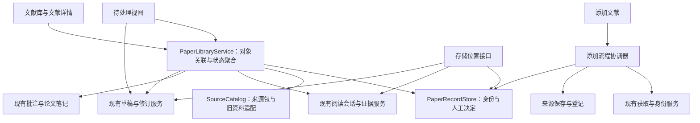

# 开发路线：以原文证据为基础的阅读与知识沉淀

更新日期：2026-09-10。代码基线：`codex/research-learning-map`，`0.51.2`，提交 `d3a6e7525f2c604ae314c13925454c63f083f554`。

本路线根据用户提供的产品建议、当前代码和既有验收文档制定，作为后续开发的优先级依据。路线制定时只更新项目文档；实施进度见下方记录。建议中的目录树和操作步骤属于设计输入，不构成迁移、删除或模型调用的授权。

实施进度：截至 2026-09-11，已完成 [R0 前两批：纯文献聚合、独立状态与实际资料只读适配](library-r0.md)、[第三批：持久人工决定与恢复](library-records-r0.md)、[第四批：旧资料兼容与性能基线](library-compatibility-r0.md)、[第五批：科学阅读质量样本与离线证据基线](reading-quality-baseline-r0.md)，以及[第六批：真实 JATS 公式修复](jats-formulas-r0.md)。运行版本为 `0.52.2`。3 篇论文共 18 题已固定并核对证据位置，JATS 公式修复与原始失败分别记录；模型答题及独立人工复核待完成，R0 尚未整体验收，R1–R6 尚未开始。

全文获取 M1–M6 已完成的接口与兼容约束继续有效；[原架构方案](fulltext-acquisition-design.md)保留为历史设计基线，后续排期以本文为准。里程碑编号表示交付顺序，不提前承诺版本号或完成日期。

## 1. 产品定位与成功标准

Research Agent Reader 的目标是成为本地优先、证据可追溯的科研文献阅读与知识沉淀工具：帮助用户保存资料，逐步理解论文，对照原文核对解释，选择性整理为笔记，再围绕研究问题比较和使用已有知识。

主流程为：**添加文献 → 阅读与追问 → 核对依据 → 选择性整理 → 专题使用**。下载、转换和模型调用按这条流程提供服务。

成功标准是用户能够回答四个问题：正在处理哪篇文献、内容来自哪里、下一步是什么、结果保存在哪里。工程验收分别检查：

- 未配置模型时，仍能保存书目信息或可用原文，并在重启后找到它。
- 从文献详情能找到对应版本、阅读会话、摘录和主要论文笔记；来源不明确时显示待关联。
- 阅读中保存摘录不调用模型；之后能找回、核对、预览并选择性整理。
- 任一保存的科学表述能区分作者原文、AI 解释、个人理解、外部资料与综合判断。
- 旧来源和历史仍可读；证据不可定位时保留历史并提示复查，人工修改不会被覆盖。

长期核心保留原文管理、分模块讲解、支线追问、证据对照、批注、知识整理和受限检索。通用编程 IDE、自动科研执行、大规模网页采集、多 Agent 自治与自动科学裁决不进入当前主线。代码阅读继续服务论文方法理解；代码练习保留兼容入口，暂停新增能力。

## 2. 对原建议的采纳与调整

| 建议 | 路线决定 | 根据当前项目的调整 |
|---|---|---|
| 收敛为科研阅读与知识沉淀 | 采纳 | 以完整阅读流程安排功能，不按供应商或 Agent 类型安排首页 |
| 统一文献详情与四个主入口 | 采纳，分步落地 | 先补对象关联，再做详情与导航；研究专题未交付前不放空白主入口 |
| 获取全文并入添加文献 | 采纳 | 不只合并按钮，优先补齐本地 PDF 无模型保存和仅元数据记录 |
| 区分生成、理解和审阅状态 | 采纳，复用已有标记 | 节点已有 `learningState` 和证据核对记录；缺的是文献级状态与一致展示 |
| 快速摘录后整理 | 采纳，扩展现有批注 | 批注已有原文、AI、人工文本分区；先补稳定来源绑定与统一整理入口 |
| 一篇论文一份主要笔记 | 调整为默认关联策略 | 已有多笔记保持原样；用户选择主要笔记，不自动合并，也不解除 JATS 版本校验 |
| 新增 `_research/` 保存持久记录 | 接受方向，推迟路径切换 | 存储接口先准备，实际目录与迁移在 R4 经扫描、演练和具体计划审阅后确定 |
| 译文导出到 `papers/_translations/` 等目录 | 暂不固定 | 先完成包外版本层；导出位置须通过原文发现、检索与跨根边界测试再开放 |
| 四轮完成全部改造 | 拆为七个可独立验收阶段 | 基础约定、详情、添加入口分别交付；翻译与专题对照也分别验收 |
| 单独验收真实科学内容质量 | 提前到 R0 并持续执行 | 不等到最后；沿用已有失败案例，区分工程检查、定位核验和科学判断 |

保留 `papers/`、`Clippings/`、`wiki/` 的职责与跨根链接边界。此路线不调整 Wiki 页面分类规则、不移动现有包、不批量改名，也不创建目标目录树中的空目录。

## 3. 已有基础与实际缺口

以下为静态代码检查与已有验收文档所支持的事实；本轮未运行真实模型评估或扫描测试库研究内容。

| 领域 | 现有实现依据 | 尚需补齐 |
|---|---|---|
| 身份与来源关联 | [`identity.ts`](../src/papers/identity.ts)、[`catalog.ts`](../src/papers/catalog.ts)、[`vault-catalog.ts`](../src/papers/vault-catalog.ts) | `SourceCatalog` 主要围绕已保存包和旧笔记候选；缺少覆盖仅元数据文献及人工关联的持久记录 |
| 在线获取与保存 | [`fulltext/`](../src/fulltext/)、[`source-intake.ts`](../src/papers/source-intake.ts)、[`jats/`](../src/jats/)；[M4](fulltext-acquisition-m4.md)、[M5](fulltext-acquisition-m5.md) | 本地 PDF 仍走旧入库路径，没有接入新的无模型保存流程；入口与后续动作分散 |
| 阅读对象 | [`reading/types.ts`](../src/reading/types.ts)、[`source-picker.ts`](../src/reading/source-picker.ts) | 交互阅读支持 PDF、验证过的 MinerU、JATS 和代码；普通 Markdown 可在普通阅读器打开，不能据此宣称它具备完整交互深读能力 |
| 阅读状态 | [`progress.ts`](../src/reading/progress.ts)、[`entry.ts`](../src/reading/entry.ts) | 已有节点人工理解标记；`completed` 用于讲解主线完成，尚不等于文献级阅读完成或笔记审阅 |
| 批注与摘录 | [`annotations/types.ts`](../src/annotations/types.ts)、[`annotation-service.ts`](../src/annotations/annotation-service.ts) | 已有原文、个人文本、AI 文本与部分位置上下文；缺少跨 PDF/JATS/Markdown 一致的版本绑定及待整理状态 |
| 既有知识修订 | [`curation/`](../src/curation/)、[知识整理](knowledge-curation.md)、[JATS 修订](fulltext-acquisition-m6-curation.md) | 可修改限定目录中的已有正文，具备预览、恢复和撤销；通用新建知识页及跨版本论文笔记仍需单独设计 |
| 检索与维护 | [检索说明](semantic-retrieval.md)、[`views/knowledge-curation.ts`](../src/views/knowledge-curation.ts) | 已有正式知识与学习索引隔离、待审阅和需复查视图；尚未聚合获取、登记、摘录等跨流程待办 |
| 持久存储 | [`reading/store.ts`](../src/reading/store.ts)、[`curation/store.ts`](../src/curation/store.ts)、[`fulltext/file-storage.ts`](../src/fulltext/file-storage.ts)、[`plugin.ts`](../src/plugin.ts) | 会话、修订、助手和多种恢复记录依赖插件目录；不同数据不能统一当作缓存处理 |
| 翻译与专题对照 | 现有讲解、证据引用、修订、检索和综合动作可复用 | 本轮未发现完整的段落译文版本层或受限文献证据矩阵实现；建议提及的翻译设想不计为已实现功能 |

已有工程检查见[全文与 JATS 检查报告](fulltext-acquisition-review.md)。[知识整理文档](knowledge-curation.md)记录过小规模真实模型验收及错误分类，不能将整个项目写成“从未评估”，也不能将这些结果外推为新 JATS 路径的科学质量保证。

## 4. 架构原则

### 4.1 用聚合层连接现有对象

新增的文献层负责组织与查询；来源、会话、批注和修订仍由各自服务负责写入。以下模块名是拟议接口，不表示代码已存在。

文献层返回能力和阻塞原因，例如可打开原文、可开始深读、需要补充身份、来源待复查。界面根据实际能力提供动作；普通 Markdown 不获得虚构的页码、结构化引用或图像核验状态。打开列表或详情只读取本地资料，不自动查询来源、生成内容或更新远程向量索引。

不要把 `SourceCatalog.associate()` 当作每次渲染的查询函数：当前无匹配包时会生成 `paperId`。只读列表不得分配持久 ID、写人工决定或产生新的获取任务。已有写入接口继续严格校验；列表聚合可单独展示损坏记录，但不能把损坏包作为可用来源。

### 4.2 沿用身份体系，补齐关联记录

| 对象 | 沿用的身份或引用方式 | 新增职责 |
|---|---|---|
| 文献 | 已有 `paperId`、规范化 DOI / PMID / PMCID | 无原文时也能持久保存；记录人工关联与主要笔记选择 |
| 书目引用 | `citekey` | 不承担文件版本或阅读会话身份 |
| 原文与版本 | `packageKey`、来源版本、文件摘要 | PDF、JATS、转换正文可以同属一篇文献，但不互相替换 |
| 转换投影 | 原有 `projectionId`、转换器版本 | 新转换保留旧引用指向的历史版本 |
| 阅读与解释 | 会话 ID、节点 ID、来源指纹 | 详情聚合多会话，不自动拼接不同会话背景 |
| 证据 | 各来源已有定位结构、实际片段与哈希 | 统一外层引用，内部保持页码／正文块／字符区间／XML 位置差异 |
| 正式笔记 | Markdown 文件及内容指纹 | 只保存关联，不另存一份可覆盖 Markdown 的隐藏正式正文 |

新文献仍使用既有 `p-…` 标识规则，不增加平行的“文献 ID 系统”。读取旧资料时没有可靠 ID 或标识的，显示独立待关联条目；渲染键只是临时 UI 键。用户明确保存记录或确认关联后才持久化。

精确标识相同且无冲突时可以关联；同标题不自动合并。已有多个 `paperId`、多个 citekey、不同稿件关系或冲突标识进入复查，原记录保持可读。无 DOI 的本地资料允许人工确认的临时书目身份，注明缺口；以后补 DOI 时核对已有记录，保持原 `paperId`，不自动吞并另一文献。

文献级标题更新不重写包内身份快照。主要笔记仅为导航选择，不能绕过现有身份或 JATS 来源版本守卫；跨版本共同写入一篇笔记须在证据级多来源契约交付后再开放。

### 4.3 分开内容角色与状态

四类内容为原始资料、学习过程、正式知识、研究组织。分类决定检索范围和保存职责；同一笔记中的具体段落仍需区分原文引用、AI 解释、个人笔记、外部资料、综合判断。放进 `wiki/` 或点击保存，不会自动提高证据等级。

| 状态维度 | 来源／写入者 | 展示与兼容要求 |
|---|---|---|
| 获取、正式保存、登记 | 各任务和提交回执 | 下载完成、包保存、索引登记分别显示，不能相互推导 |
| 讲解进度 | 现有节点生成状态与路线 | `completed` 继续表示主线生成完成，不改旧字段语义 |
| 阅读状态 | 用户明确标记 | 拟新增未开始、进行中、已完成、待回看；旧数据缺失显示未标记，不从生成量推断 |
| 节点理解 | 现有 `learningState` | 继续使用未标记、已理解、待回看、仍有疑问 |
| 笔记审阅 | 用户审阅决定与所审正文哈希 | 草稿生成不等于已审阅；正文变化后原审阅记录保留并提示需复查 |
| 证据核对 | 来源一致性检查、图像读取回执、人工核对 | 机械定位、模型接收图像、人工判定表述受支持分别记录 |
| 待处理事项 | 对上述对象的派生视图 | 同一底层对象同一问题只展示一次；重新核验后更新，不再创建一套任务真相 |

未解决问题先按用户标记统计，必须注明范围；没有该标记的历史不能显示成“0 个疑问”。`metadata-only`、`abstract-level`、`x-ray` 继续表示处理深度，与阅读完成和笔记审阅独立。

### 4.4 保留存储边界，先接接口再迁移

- `papers/` 保存已验证原文包，`Clippings/` 保存外部剪藏，`wiki/annotations/` 保存摘录与批注，`wiki/qa/` 保存用户选择导出的学习记录。各包内部结构保持现状。
- `wiki/sources/` 的界面名称改为“论文笔记”；已有 concepts、methods、datasets、projects 等目录继续使用，不增加“已读／待读”目录。
- `papers/`、`Clippings/`、`wiki/` 之间继续不创建普通 Markdown 链接或 Wikilink；由插件依据对象关联提供原文跳转。Wiki 内部按原规则链接。
- `_research/` 是 R4 的候选持久记录根，需配置、格式版本与兼容读写设计。当前插件目录仍是实际位置，不因本文发布立即切换。
- 会话、人工决定、修订前后快照、唯一下载全文、未完成入库事务都是需保留的数据。检索索引才是可重建派生缓存；重建可能需要网络和费用，不等于无代价。
- R0 为新增记录提供存储位置接口，旧服务逐步适配。不同数据类型每次只有一个明确写入位置，兼容读取不得产生双写分叉。
- API 密钥和本机凭据不进入迁移包；相对 Vault 路径与外部机器路径分别处理。迁移记录不应改变设备所有权，让另一设备接管未完成任务。

## 5. 里程碑与验收门槛

依赖主线：**R0 → R1 → R2 → R3 → R4**；之后 R5、R6 可分别交付，专题对照不依赖翻译。默认先做 R5，再做 R6；每阶段拆成可单独提交的步骤。

### R0：最小关联契约与质量基线

**交付目标：** 为文献详情提供可靠的数据基础，同时冻结旧行为的验证样本。

1. 定义文献聚合、能力、内容角色和独立状态契约；实现只读现有对象适配器。
2. 为新增身份与人工状态提供最小 `PaperRecordStore` 和存储位置接口。首次显式写入复用已有 `paperId`；新记录原子创建；并发保存和标识冲突可恢复。
3. 拆出来源目录只读查询与关联决定，避免渲染过程创建身份。旧包与旧会话不改格式。
4. 建立工程固定样本、真实阅读质量方案和本机性能基线。只读聚合先记录冷启动、增量更新、内存与扫描次数，再确定后续性能预算。

**验收：** 同论文 PDF/JATS 与旧 MinerU 可关联；无标识资料保持独立；冲突和损坏资料明确显示；阅读列表零写入、零模型调用；重启后人工状态保留。旧 v1/v2 JATS 投影、旧阅读引用继续通过原校验。

**不纳入：** 首页重排、任意目录迁移、跨版本笔记合并、批量补元数据。

### R1：文献详情与一致的导航状态

**交付目标：** 从一个文献上下文找到已有内容，先完成可浏览和继续阅读的最短路径。

1. 文献列表与详情展示书目信息、来源版本、阅读会话、批注、论文笔记及关联代码；对无法可靠关联的记录保留独立入口和原因。
2. 增加用户阅读状态、主要笔记选择；复用节点理解标记，分开展示讲解完成与证据核对。
3. 首页先提供文献库、阅读空间、知识整理；默认内容为继续阅读、待处理摘要和最近整理。研究专题在 R6 有可用内容后加入。
4. “PDF 深读”显示为“文献深读”，“文章 Wiki”显示为“论文笔记”；保留 action ID、命令兼容和历史记录入口。
5. 代码阅读放入关联对象及扩展菜单；代码练习、维护、导出进入次级菜单，旧数据继续可用。

**验收：** 从列表打开详情，再打开指定版本或继续对应会话；多版本不会串会话；切换页面不调用模型；测试／演示会话不污染正式进度；来源缺失时仍能查看历史。检查空库、旧库、混合来源库和窄窗口。

### R2：统一“添加文献”与来源补全

**交付目标：** 用户先保存文献，再独立选择阅读、转换或生成笔记。

1. 添加入口接收单个本地 PDF、DOI/PMID/PMCID 和已支持链接；沿用现有精确查询和 URL 校验，错误显示可执行的替代方式。
2. 身份核对后提供仅保存书目信息、保存原文、补充版本、打开已有来源。仅元数据也有持久文献记录，能出现在文献库和待处理中心；沿用 `metadata-only` 边界，不为完成保存而生成空壳 Wiki、虚构中文译名或调用依赖论文笔记的登记流程。
3. 本地 PDF 接入与在线 PDF 共用的来源确认、哈希、发布和恢复流程；对本地文件设计明确来源凭据，不伪装成 PMC/Unpaywall 下载记录。
4. 在线全文候选保留出版版本／作者接受稿、许可与可用格式；格式默认按实际能力推荐并允许用户选择。已选来源失败不静默替换用户要求的证据源。
5. 获取、转换、笔记生成与登记分开续办；无需模型的路径不经过 AI 动作配置门槛。未找到全文仍可保存已确认书目信息。

**验收：** 无模型添加 DOI 元数据与本地 PDF；标识未查到时可保留明确未核验的人工条目，不伪造书目字段；同 DOI 多版本独立保存；同一内容重复添加复用；身份冲突停止写入；网络失败、取消和重启可续办；转换或笔记失败不撤销原文保存结果。

**不纳入：** Zotero 写入、文件夹批量处理、任意网页抓取和新增大量供应商。

### R3：快速摘录、待处理中心与选择性整理

**交付目标：** 在阅读时快速保留有用内容，稍后通过既有修订系统整理。

1. “保存摘录”保留选中文字、上下文、来源版本、定位和个人备注，不调用模型；“针对选中内容提问”作为独立动作。
2. 扩展现有批注结构，按内容片段区分原文、AI、人工、外部资料与综合判断。旧记录保留可读状态，缺失来源版本时标记未核验；不批量推断或改写旧正文。
3. 待处理中心聚合元数据待补全文、下载待保存、登记待续办、转换缺口、摘录待整理、草稿待审阅、来源变更待核对；每项能回到对应对象并显示下一步。
4. 先支持摘录／学习记录补充到已有论文、概念或方法笔记，复用 `CurationService` 的证据读取、差异预览、事务和撤销。适配器不能绕过它的现有来源守卫。
5. 通用新建知识页先交付可恢复草稿；后续单独增加单页创建、身份查重、目录校验及索引／日志预览，再允许用户明确保存。初始论文笔记沿用现有 create-only 流程。

**验收：** 一次保存后重启可找回摘录；文字与位置精确对应；AI 与个人内容可独立编辑；同段重复保存能复用或保留用户选择的新版本；正文变化使引用待复查；建议不默认选中；应用前来源／目标变化会阻止写入；部分失败和撤销保留用户编辑。

**限制：** 不自动批量创建概念页，不把学习回答写回检索证据池；多来源版本共同整理一篇笔记，先完成单独契约与反例测试再扩展。

### R4：持久记录独立存储与可恢复迁移

**交付目标：** 重要历史可独立备份和恢复，完成一次可验证的存储切换。

1. 只读盘点真实配置、路径、数据类型、身份、引用、文件大小与哈希；区分持久记录、唯一副本、可重建缓存和凭据。输出逐文件迁移计划，不将建议目录树当作实际库存。
2. 在保留的测试副本上演练路径解析、版本兼容和恢复，确定 `_research/` 或用户配置位置。首先迁移文献关联、会话、助手与修订依赖闭包；未完成获取／入库记录及其二进制资料可先保持旧位置。
3. 正式执行采用暂停相关写入、复制、核验、原子切换路由、恢复写入的步骤。原文包优先不动；一次只切换验收完毕的数据类型。
4. 迁移日志可重入；复制中断、目标同 ID 不同内容、来源变化、空间不足及同步冲突均停止切换。兼容期读取旧格式和已知旧位置，每类只有一个写入端。
5. 回退需考虑切换后新增记录：旧位置副本不能冒充最新状态。先停写，核对切换后差异，在保留全部新记录后恢复路由；不支持安全反向同步时明确保持新位置只读并保留待恢复报告。

**验收：** 在测试副本完整演练复制、校验、切换、中断恢复和回退；所有迁移对象及其证据引用可打开；新旧数量、哈希和引用关系符合清单；唯一全文、人工修改与旧版本历史完整；敏感配置不被混入共享数据。

**执行边界：** 先提供具体扫描结果和迁移预览，再由用户批准正式 Vault 切换。迁移程序不删除旧文件或目录；需要多文件清理由用户手动完成。目录配置也不能绕过可信根、链接检查和设备所有权。

### R5：阅读中的翻译层

**交付目标：** 当前段落可翻译、对照、保存和人工修订，译文能够返回当时的原文。

1. 先做选段翻译，再做当前章节；不先做全库批量翻译。
2. 译文绑定来源版本、原文片段、术语表版本、生成模型和译文修订号，保存在原文包外。人工修订保留为独立版本，再生成不覆盖。
3. 优先复用现有模型配置、取消、用量和来源核验能力；原文变更显示译文过期，不能把译文当作原始证据或原文投影。
4. 导出按用户选择的范围生成 Markdown；导出路径通过发现器、索引和链接边界测试后再开放，不立即固定 `_translations` 目录。

**验收：** 原文包哈希不变；每段译文可回到同版本原文；术语、数字、单位、否定和条件限定通过冻结样本人工复核；缺失或不可解码的原文明确失败；重试和重启不覆盖人工修改。

### R6：围绕研究问题的专题对照

**交付目标：** 对用户明确选定的少量文献生成可逐项核对的比较材料。

1. 用户先确定研究问题、材料范围和比较维度；首版限定 2–5 篇，展示实际纳入的来源与阅读深度。
2. 每个矩阵单元保留对应文献、来源版本、原句／图表、条件和核对状态；依据缺失显示空缺或尚未核对，不能自动借用相邻论文的结果。
3. 区分作者报告、用户判断与综合推断；同一论文的多个版本和由它导出的笔记不计作独立证据。
4. 先预览证据矩阵和综合草稿，再显式保存到已有专题或创建单个专题；沿用用户既有项目组织，不统一重排 `wiki/projects/`。
5. 搜索保持正式知识、学习记录和原文的明确范围。需要从原文补证据时显式进入该范围，不将学习回答静默用于正式结论。

**验收：** 每个非空单元能追溯到正确文献；受限材料外的内容不混入；来源变更使相应单元待复查；不同指标定义、单位和条件不被强行合并；保存前展示全部目标变化，恢复与再次保存不覆盖手工判断。

## 6. 共用开发与质量验收流程

### 6.1 每个独立步骤的交付顺序

1. 选定一个用户场景，列出依赖接口、旧数据样本和本步不支持的情况。
2. 先固定输入、预期行为和关键失败反例，再修改领域服务；通过适配器接入现有代码。
3. 接上可实际使用的 UI，检查空状态、失败、取消、重启、重复点击及用户修改后的行为。
4. 运行相关安全定向测试；代码改动完成类型检查和生产构建。先检查测试清理行为，不运行含批量／递归删除的旧总入口。
5. 在测试 Vault 做原生交互验收，记录真实调用、模拟写入和真实写入的边界；测试前保存必要布局与文件基线，完成后恢复。
6. 涉及讲解、翻译或科学整理规则时，运行本阶段的冻结质量样本；记录失败和未验收范围，不用工程测试数量替代科学判断。
7. 更新阶段文档、改动与测试记录；复核任务范围后提交并推送当前分支。只有代码交付并验证完成才更新版本、部署测试插件。

文档步骤只进行链接、结构、状态和 Git 差异检查，无需为了文档改动调用模型、重新部署或重复跑完整功能测试。

### 6.2 冻结样本和判断标准

R0 先建立两组不同用途的材料：

| 样本组 | 最小覆盖 | 如何使用 |
|---|---|---|
| 工程兼容样本 | 同 DOI 多来源；不同论文同标题；仅元数据；无 DOI；旧 MinerU；旧/新 JATS 转换器；旧批注；外部 PDF；缺失/损坏来源；中断修订 | 使用合成或已有公开测试数据，检查身份、定位、恢复和零意外写入，不得自动删除测试目录 |
| 科学内容样本 | 已选 3 篇 CC BY 全文，覆盖 PDF/JATS、数字单位、方法条件、主图/表格和作者局限；每篇 6 个固定问题 | 题目与原文范围已固定，参考要点待独立人工复核；后续记录模型、规则版本、实际输入与输出、费用及失败原因 |

科学样本的准备和来源检查已完成，见[第五批记录](reading-quality-baseline-r0.md)；模型表现基线尚未完成。来源不能合法获得、图像未读取或扫描件无法提取时，应产生明确缺口而不是补写答案。题目可以用模型辅助整理，但最终科学判断不能仅由生成答案的模型自评。

每次报告分开列出：可定位引用、原文对表述的支持程度、数字与单位、否定／限定条件、图表实际读取与解释、结论越界及未回答问题。错论文、伪造引用、单位数量级错误、否定反转、未读取图像却声称视觉核验属于阻塞问题；修复后保留原失败结果并复测。小样本通过只说明该样本表现，不证明全库或所有模型准确。

R1/R2 重点考察任务可达性与失败恢复，R3 考察摘录保真和受控写入，R4 考察数据恢复，R5/R6 增加对应的翻译及跨论文判断。每阶段保留下一步可复用的成果，未通过的能力不向后扩张。

## 7. 下一次开发的具体起点

下一步继续 **R0 的真实科学质量基线**。各独立步骤的当前状态如下：

1. **已完成：** 在 `src/library/` 定义聚合 DTO、能力、关联结果和人工状态，复用既有身份与证据类型；实现纯内存关联，并覆盖同文献多来源、无 ID 旧资料、冲突和只读零写入。[实现记录](library-r0.md)列出边界。
2. **已完成：** `SourceCatalog.inspect()` 和实际只读适配器读取来源、已保存会话、Wiki 及本插件批注；不初始化阅读恢复、不分配身份、不查询网络或调用模型。坏包和不支持格式返回诊断；旧 MinerU 默认未核验，旧批注不按路径借用身份。`0.51.3` 原生验收已记录两次扫描和 879 个文件哈希保护，尚无文献详情页。
3. **已完成：** `0.52.0` 增加 `PaperRecordStore` 与插件目录追加日志；首次人工保存复用已有 ID，主要笔记选择绑定编辑凭据，处理并发版本、未提交尝试与独立进程恢复。来源入库读取保存的身份，避免原文包缺失后另建文献 ID。
4. **已完成：** `0.52.1` 支持显式单包 MinerU 完整核验，全部资产读取进入同一次预算；兼容外部 `annotation_schema: 2` 并保留未确认的来源关系。真实测试库 5 个旧包核验通过，3 条外部批注可读，879 个文件哈希不变；混合格式 403 / 2,003 / 4,003 个对象的首次、重复和修改后重扫已测量，详见[兼容与性能记录](library-compatibility-r0.md)。
5. **样本与工具已完成：** 3 篇合法全文、18 题、27 个文件及指定证据锚点已固定和离线核验；图表定点检查与暂定参考要点形成复核包。保留 DESeq2 JATS 阻塞、Sopa 公式／资源缺口及调查论文补充材料缺口，详见[科学阅读质量样本](reading-quality-baseline-r0.md)。尚未运行模型答题或独立人工复核。
6. **已完成：** `0.52.2` 新增 `rar-jats-3`，处理 DESeq2 与 Sopa 共 118 处公式及其备用资源要求；真实来源可投影，补充材料缺口保留。旧版本包和冻结题目原样回放，新增当前转换器观察命令；[复测记录](jats-formulas-r0.md)区分工程渲染与科学审阅。
7. **下一步：** 执行冻结问题的真实模型问答与独立人工裁定，保留实际输入、图像提供、用量及失败。当前仍为全库重扫，真实大型 PDF/JATS、操作系统冷缓存和长期内存表现未验收。接口与验收稳定后进入 R1。无 ID 旧资料的显式登记入口、身份编辑和科学审阅状态写入尚未开放。

这些步骤不迁移正式 Vault，也不将建议文件中的 `_research/` 直接作为新写入根。

## 8. 文档与证据边界

路线制定时的分析来源为用户提供的建议、上述 TypeScript 源码静态检查和仓库已有实现／验收记录。该文档步骤没有读取论文全文来形成科学结论，没有运行项目业务流程或真实模型，没有新增论文、研究笔记、索引或 Vault 日志；科学处理深度不适用于软件路线规划。后续实现及运行验证按阶段文档另行记录。

路线制定步骤只新增本文，并在 README、全文架构和入库深读历史文档中加入后续路线入口。原用户建议、原全文架构提案、测试库及既有研究内容保持不变。未来会影响目录、schema 或正式数据迁移的步骤，应依据当时具体可审阅方案执行，不能以本路线代替实际扫描与验收。
