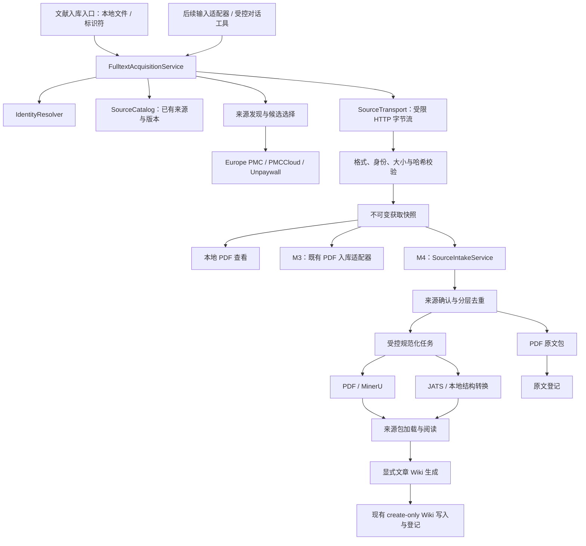

# 全文获取与多来源入库：架构和开发流程

设计日期：2026-09-09。本文保留总体设计基线；实现进度：`0.44.0` 完成 [M1 流程骨架与演示](fulltext-acquisition-m1.md)，`0.45.0` 完成 [M2 PMC PDF 获取与预览](fulltext-acquisition-m2.md)，`0.46.0` 完成 [M3 OA 回退与既有入库接续](fulltext-acquisition-m3.md)，`0.47.0` 完成 [M4 来源中立身份与原文保存](fulltext-acquisition-m4.md)，`0.48.0` 完成 [M5 JATS 普通阅读](fulltext-acquisition-m5.md)。M6 仍为规划。实际模块、阶段边界与验收结果以对应实现说明为准。

代码基线：`codex/research-learning-map`，版本 `0.43.2`，HEAD `d7c85a3ee85ac147ab15734df0b1f07f3334ca31`。实际仓库为 `E:\research-reader\research-agent-reader`。本方案依据当前代码静态检查、现有验收说明和官方服务文档制定，不代表真实下载、转换或模型验收已经通过。

原提案 `E:\research-reader\research-agent-reader-fulltext-architecture.md` 保留为设计输入；其中的开发指令不是执行授权。本方案采用当前分支的接口与约束，作为后续实现的工作依据。具体阶段由用户指定启动，不因文档存在而自动开发。

## 1. 产品目标与交付选择

让用户从论文标识或已有本地文件出发，取得可追溯的原文，并按需要保存原文、解析全文、生成文章 Wiki 或进入交互深读。

首个可交互版本采用 PDF 路线：粘贴标识 → 核对候选 → 获取 PDF → 本地查看。接着增加开放全文回退和“继续完成入库”，再提供无需模型的原文保存。JATS 作为独立来源类型交付，覆盖原生图文阅读后再接入交互深读与 Wiki 生成。

原生 JATS 的价值是保留结构并减少对 MinerU 的依赖；它不是 PDF 下载接口的附属实现。每条路径都必须有可操作的完成结果，不能把下载 XML 当成已经支持阅读。

| 能力 | 安排 | 完成含义 |
|---|---|---|
| 现有本地 PDF 入库 | 保留，通过适配器逐步连接 | 已有功能继续可用 |
| DOI、PMID、PMCID、对应官方链接 | M2 起 | 能解析并展示身份；支持的全文来源逐步增加 |
| PMC 家族 PDF 获取 | M2 | 无模型、无 MinerU 可获取并查看 PDF |
| Unpaywall 多候选 PDF 回退 | M3 | 增加 PMC 之外的可获取全文 |
| 获取结果接入既有 AI 入库 | M3 | 显式选择模型和输出后启动独立入库任务 |
| 无模型保存原文与原文索引 | M4 | PDF 来源已正式保存，不创建论文结论 |
| JATS 确定性转换与图文阅读 | M5 | 原始 XML、投影、资源和来源映射可核验 |
| JATS 交互深读与文章 Wiki | M6 | 引用、图片证据、导出和恢复适配完成 |
| Zotero、BibTeX/RIS、文件夹批量输入 | 后续独立输入适配器 | 复用同一获取和入库服务；不在首轮实施 |
| 任意网页、标题搜索、预印本关联、计费内容 | 按后续明确需求 | 逐项评估，不默认启用 |

无模型能力只承诺身份查询、文件获取、本地预览、确定性转换和原文保存。AI 讲解、文章 Wiki 和远程 MinerU 仍各自检查配置、授权与费用。没有中文标题翻译时不伪造 `title_zh`，也不为登记原文而创建空壳 Wiki。

## 2. 当前代码事实与复用边界

| 现有模块 | 已核实行为 | 新架构的接入方式 |
|---|---|---|
| `src/actions.ts`、`src/modals/action-input.ts` | 当前文献入库属于 AI 动作，围绕本地 PDF 和 Markdown/Wiki 输出配置 | 新增不经过模型可用性门禁的获取入口；原入库表单继续使用 |
| `src/agent/tools.ts` | Crossref 精确查询、标题搜索、Vault 候选和 DOI 检索工具 | 抽取或适配请求/规范化函数；无需启动 Agent 才能查元数据 |
| `src/agent/paper-ingest-flow.ts` | 身份凭据校验绑定 Crossref；人工回执绑定 PDF 页面栅格 | 保留旧契约；M4 新增来源中立的身份与确认契约 |
| `src/agent/agent-loop-service.ts` | 插件安排身份、去重、确认、转换和草稿阶段；模型参与身份输出 | M3 通过旧入口接续；M4 将确定性核验结果与模型正文生成分离 |
| `src/agent/pdf-identity.ts` | 授权 PDF 快照、第一页线索、PDF.js 页面确认；128 MiB 上限；快照释放会删文件和目录 | 复用读取与渲染能力，重新绑定文件哈希；持久获取快照不得传给旧释放函数 |
| `src/agent/mineru-publish.ts` | 验证、发布 MinerU 包；失败路径存在整树清理，成功路径删除空目录 | 保留包格式；真实接续前处理本项目禁止目录/批量删除的冲突 |
| `src/agent/ingest-registration.ts` | 以已有轻量 Wiki 为入口登记索引、CSV、BibTeX | 不能用于无 Wiki 的原文登记；M4 新增明确的原文登记路径 |
| `src/plugin.ts`、`src/runtime/persistence.ts` | TaskRun、串行保存、订阅通知、终态恢复 | 复用外层任务列表；获取详情独立存储并投影成 TaskRun 摘要 |
| `src/agent/ingest-progress.ts`、`src/views/ingest-progress.ts` | 固定入库阶段，终态成功显示“入库完成” | 保留语义；获取进度使用自己的字段与文案 |
| `src/providers/http-transport.ts` | JSON/模型文本和流式传输；普通响应 UTF-8 解码并尝试 JSON 解析 | 不拿它下载 PDF/XML；新增面向来源获取的受限字节传输 |
| `src/reader/document-loader.ts` | `papers/<key>/article.md` 固定分派给 MinerU 校验 | M5 先识别包标记，再分派；不靠路径或文件名推断包格式 |
| `src/mineru/types.ts`、`src/views/mineru-reader.ts` | 普通 Markdown 也适配成 MineruReaderPackage，混合通用展示与页坐标 | M5 增加通用阅读数据契约与旧包适配，不伪造 JATS 坐标 |
| `src/reading/document.ts`、`types.ts`、`store.ts` | PDF、MinerU article、代码三种来源；哈希绑定证据与独立会话 | M2 可无模型打开 PDF；M6 增加结构化文章来源且保留旧会话 |
| `src/security/safe-markdown.ts` | 外部 Markdown 有严格被动内容限制，原始 HTML 不可直接放行 | JATS 复杂结构经安全渲染端口处理，不放宽全局 Markdown 限制 |

当前没有找到可复用的 PubMed、Europe PMC、PMCCloud、Unpaywall、OpenAlex 或 JATS 实现。不能在排期中把它们当成已有服务。

已知历史问题继续独立记录：入库模型返回 `duplicateStatus=none` 与 Vault 回执冲突；特定 Direct API 模型的代码引用输出未通过。下载器和模拟测试不构成这些问题已修复的证据。

## 3. 确定的架构决策

1. 获取服务由插件内 TypeScript 实现，不增加常驻服务、Python 依赖、数据库服务或自治 Agent 循环。
2. UI、未来批量入口和未来对话工具调用同一领域服务。调用者传请求或已登记的候选 ID，不能指定任意网络目标或写入路径。
3. 分开记录获取、来源保存、转换、Wiki 生成和登记结果，使用任务关联连接它们。后续失败不抹掉先前已完成的事实。
4. 先交付 PDF 获取与现有工作流接续，再实现来源中立入库与 JATS。M2 即提供可用 UI，不把交互验收推迟到全部来源完成后。
5. 论文身份、出版版本、不可变文件快照、转换投影、正式包、Wiki 各有不同标识。DOI 与 citekey 不承担所有层次的身份职责。
6. 来源查询与最终身份核对不依赖模型自由裁决；AI 只能提出候选或生成受验证的正文。已确认的结构化字段由插件锁定。
7. 新来源包与旧 MinerU 包并存；不迁移旧目录、旧会话或旧引用，不用新标记绕过旧校验失败。
8. 新流程不自动删除文件或目录。取消和失败后保留有所有权记录的未完成文件，提供位置；需要批量清理由用户手工进行。
9. 接入来源按增量收益安排；不把同一数据家族的不同接口计为独立身份票数或独立覆盖率。

## 4. 模块与调用关系



各模块的职责：

- `FulltextAcquisitionService`：协调输入解析、已有来源检查、发现、选择、下载、校验和恢复；不写 Wiki，不启动 MinerU。
- `IdentityResolver`：用来源提供的精确记录建立身份、别名及冲突；输入规范化与远程查询分离。
- `SourceCatalog`：在同一处维护原文包、PDF 快照、旧 Markdown 与 Wiki 的关系。首次只有只读发现；M4 才接入新包登记及两条入库路径。
- `SourceTransport`：提供有共同网络策略的 `requestBytes` 和 `downloadToSink`；API JSON/XML 有界解析与大文件流分别实现。
- `AcquisitionRepository`：保存获取任务详情、可重放事件和快照记录；不另建任务看板，也不接管已有 TaskRun 历史。
- `SourceIntakeService`：创建原文保存计划、要求确认、执行分层去重及来源发布；提供可重入的转换/登记接续。
- `NormalizationService`：对固定快照执行已选择的解析器，产生固定投影。来源类型决定能力，不由输出文件名决定。
- `SourcePackageLoader`：识别新包或旧包，校验后提供阅读数据；文件缺失或未知 schema 不降级为“验证通过”。

`src/plugin.ts` 只负责依赖装配、生命周期、命令注册和事件连接。M1 不一次创建全部空目录、通用插件框架或动态 Provider 注册市场；随具体调用方增加文件。

建议按阶段形成以下布局；名称为设计目标，除第 2 节明确列出的文件外均不代表已经存在：

```text
src/fulltext/
  contracts.ts                 # M1：请求、结果、阶段与运行时解码
  acquisition-service.ts       # M1：协调、取消、重试、任务复用
  repository.ts                # M1：获取详情和快照端口
  identity-resolver.ts          # M2：精确标识与来源证据
  candidate-policy.ts          # M2/M3：版本、访问与候选排序
  file-validator.ts            # M2：PDF；M5：XML/资源
  providers/                   # M2：Europe PMC 身份/PMC；M3：Unpaywall
  transport/                   # M2：请求字节、下载流、目标策略
  integration/                 # M1：TaskRun；M3：旧 PDF 入库适配
src/papers/                    # M4：共享身份、SourceCatalog、来源保存与确认
src/sources/                   # M4/M5：新包清单、发布与严格加载
src/normalization/             # M5：JATS 结构、来源映射与受限渲染
src/views/fulltext-acquisition.ts
tests/test_fulltext_*.js       # M1 起：沿用现有 JS/内存测试风格
```

## 5. 用户流程和入口

控制台保留“文献入库”作为主入口，在来源选择处提供“本地 PDF”和“DOI / PMID / PMCID”。增加命令“按标识获取论文全文”，直接进入无模型的获取面板。来源解析逻辑不放到大段任务说明中让模型猜测。

### 5.1 获取路径

1. 用户粘贴标识或受支持的官方链接，界面显示识别出的类型；裸数字显示为 PMID，必须在候选预览中核对。
2. 先看已登记本地来源，再进行必要的身份查询。精确标识未解析时报告对应原因，不改用同名第一条结果。
3. 展示标题、必要作者/年份、标识、版本、可获得的文件以及实际查询过的来源。
4. 只有一个满足约束的候选时可以按请求直接获取；存在稿件版本选择或信息冲突时先停在选择/核对状态。
5. 下载期间显示实际接收字节、可信总量（存在时）和停止按钮。
6. 结果显示“文件已获取”或“已获取，身份待核对”，提供本地预览。未知身份不能自动进入正式来源保存。
7. M3 提供“继续完成入库”，打开既有输出与模型配置；M4 另提供“仅保存原文”。这些是单独的明确动作。

没有开放 PDF 时返回本次查询范围、失败原因及官方页面/手动文件入口。M2/M3 找到 XML 但还不能处理时，只说明“找到 XML 来源，当前版本尚未支持该格式”，不自动下载一批不可用资源。

### 5.2 本地路径

已有本地 PDF 保留现有行为。M4 可以选择同一个来源保存计划，但仍使用授权文件快照。后续 Zotero/BibTeX/RIS 适配器只负责产生标识或授权本地来源，不绕过身份、版本和写入规则；Zotero 默认为只读。

### 5.3 完成状态的产品含义

| 显示 | 必须具备的证据 | 不能据此宣称 |
|---|---|---|
| 文件已获取 | 已完成传输、格式检查、持久化快照 | 正文完整、已入库、已深读 |
| 身份待核对 | 格式合格，但文件与目标记录的绑定不足 | 已确认是目标论文 |
| 原文已保存 | 用户确认、来源包提交和清单存在 | 已生成 Markdown 或 Wiki |
| 正文就绪 / 部分内容未转换 | 固定投影通过检查且明确列出缺口 | 所有图表完整 |
| 图文就绪 | 正文及请求的正文图片通过资源核验 | 补充材料全部可用、论文结论正确 |
| Wiki 已生成 | 现有正文校验与 create-only 写入成功 | 达到 x-ray 深度 |
| 登记待完成 | 来源或笔记已提交，但索引登记未完成 | 应重新下载或重新生成笔记 |

## 6. 身份、版本、快照与去重

### 6.1 标识层次

| 标识 | 定义与产生方式 |
|---|---|
| `paperId` | 本地稳定论文记录 ID；经验证的 DOI/PMID/PMCID 是其别名，不直接变成路径 |
| `publicationVersion` | `version_of_record / accepted_manuscript / preprint / unknown`；记录证据，不靠文件名推定 |
| `sourceVersionId` | 来源自己的版本标识；PMC 数字版本不作时间大小排序 |
| `snapshotId` | 一次不可变原始文件集合及身份绑定的 ID；各文件分别 SHA-256 校验 |
| `projectionId` | 原始快照、转换器版本、参数和产物清单摘要的组合身份 |
| `packageKey` | 经插件分配的安全目录名，与书目 citekey 分开 |
| `citekey` | 书目和 Wiki 的既有键；不因 PDF/JATS 增加一种表示就另造一篇论文 |

不因标题相似合并 paperId。精确标识映射有冲突时保持候选隔离；人工确认不能伪造来源回执，只能形成带说明的独立人工决定。预印本与正式出版记录不自动合并。

### 6.2 来源中立的元数据

M1 先在全文模块定义内部 `ResolvedIdentity`；M4 有第二个真实调用者时再提取到共享 `src/papers/identity.ts`，不提前改写全部 Agent 类型。

身份记录包含原始标题、作者数组、年份、文献类型、标识与逐字段证据。保留来源 ID、查询时间和选择依据；避免复用当前 Crossref 展示层“最多四位作者”的文本作为完整作者元数据。

Crossref miss 只代表该来源未返回记录。PubMed/PMC 精确记录可独立支撑相应身份，不要求每篇论文都能由 Crossref 解析。M2 先由 Europe PMC 提供 PMID/PMCID/DOI 映射；只有真实失败样本证明需要时，才新增单独的 PubMed 或 PMC ID Converter 适配器。

### 6.3 确认回执

M3 的旧 PDF 入库继续使用现有 v1 页面回执，并重新核对本次授权快照；获取结果不能伪装成模型已经执行过的工具回执。

M4 新增 v2 回执，绑定 `requestId + snapshotId + primaryArtifactHash + identityDigest + displayedEvidenceDigest`，并区分：

- PDF：复用 PDF.js 展示和页面栅格证据，保留页码、渲染参数与显式用户确认。
- JATS：展示主文章 front matter、标识与正文开始内容，绑定原始 XML 及实际展示片段；不填造 PDF 页码或栅格字段。

旧 v1 验证器继续只接收旧回执。v2 支持必须同时有对应的展示器与校验器，不能只新增可传入的布尔 `confirmed`。

### 6.4 分层去重与并发

依次检查：论文关联 → 来源版本/表示 → 文件或投影是否一致 → Wiki 是否存在。相同 DOI 的 PDF 原文包不会阻止为同论文补建 JATS 投影，也不意味着 Wiki 已经存在。

旧来源只有 DOI/标题而无版本证据时标为 `unknown`。严格版本请求不自动命中；用户可核对后选择复用。Clippings 可作为已有正文候选，不自动证明存在同版本 PDF。

同一论文、同一已知版本、同一表示、同一访问策略的获取请求可以复用活动任务 ID。第二次点击打开已有任务，不另建下载；停止按钮明确停止这一个共享任务。M1/M2 不提供多个订阅者分别拥有取消权的后台调度抽象。

下载前同源 URL/来源文件 ID 可合并任务；下载后只有内容哈希和身份绑定均一致才合并快照。不同来源发现同一文件时保留所有发现证据。

## 7. 来源选择与网络策略

### 7.1 接入次序

| 组件 | 时间 | 限定职责 |
|---|---|---|
| LocalSource | M1/M2 | 查已有来源与已获取快照；不是磁盘全盘搜索 |
| EuropePmcIdentity | M2 | 将精确标识解析成身份与 PMCID 线索 |
| PMCCloud | M2 | 按 PMCID 查询版本，再取该版本 JSON 清单提供的 PDF 地址 |
| CrossrefIdentity | M2，适配现有基础 | DOI 精确元数据；不保证全文可访问 |
| Unpaywall | M3 | 发现完整 OA location 集合，逐个尝试合格的 PDF 候选 |
| EuropePmcJats | M5 | 获取 OA 子集的 XML；媒体必须有可核验的同版本来源 |
| OpenAlexMetadata | 后续按证据选择 | 与 Unpaywall 比较接口/标识增量，不预设独立 OA 覆盖 |
| OpenAlexContent | 单独后续阶段 | 独立计费开关、预算与下载凭据 |

当前官方说明中，Unpaywall 与 OpenAlex 的 OA 信息共享数据管线。PMC 与 Europe PMC 的相关内容也常来自同一家族。覆盖统计以去重后的论文与版本为单位。

PMC 通过精确 PMCID 前缀列出可用版本，再读取每版元数据；不下载全库 inventory，不硬编码 `.1`，不采用旧 `oa.fcgi`。版本元数据中的稿件类型和文件清单优先于数字大小。JSON 返回的校验值可用于远端一致性检查，本地仍计算 SHA-256。

### 7.2 默认调度

先本地，再有界的身份/发现窗口。初始元数据并发 2、文件并发 1，同主机共享限流；首版不并行下载所有候选。PMC 没有满足目标的 PDF 时才启动已配置的 Unpaywall 回退。候选失败继续下一候选，来源未启用或配置缺失要单独显示。

来源声称的格式、版本和许可先作为证据保存，下载后复核。`url_for_landing_page` 不是 PDF 下载地址；`url` 可能回退到落地页。首轮不通过任意网页提取器猜 PDF。

### 7.3 传输限制

| 项目 | 起始设计值 | 说明 |
|---|---|---|
| 元数据单响应 | 2 MiB | 超限明确失败，不静默截断 JSON/XML |
| PDF | 64 MiB | 对齐当前阅读/MinerU 上限；不沿用 100 MiB 下载建议 |
| JATS XML | 20 MiB | 同时限制深度、节点数和正文规模；M5 标定 |
| Markdown 投影 | 16 MiB | 对齐当前包正文上限 |
| 正文图片合计 / 包合计 | 48 MiB / 128 MiB | 先对齐现有预算；源文件与派生文件均计入包总量 |
| 单次获取总字节 | 128 MiB | 多候选失败和重试接收的字节也计入 |
| 元数据总超时 | 20 秒 | 排队与尝试预算分别记录 |
| 文件连接 / 空闲 / 总超时 | 15 / 30 / 120 秒 | 另设一次获取总时限，不能每重试重置总预算 |
| 一次获取主动执行预算 | 5 分钟 | 等待用户时不占连接；恢复重新评估链接和预算 |

这些是工程起始值，不是供应商承诺。不同能力仍分别报告：原文件可保存但缺少可用文本层，不等于正文提取成功。后续提高限制必须同时评估 PDF.js 内存、图像解码和打包总量。

传输端口使用流式落盘、背压、取消与哈希；按接收字节执行上限，不能只看 Content-Length。压缩响应还要限制解压后大小。XML/PDF 的共享能力是字节获取，不是强制 JSON 解码。

仅允许受支持 HTTPS 目标，检查协议、端口、用户信息、主机解析地址和每次重定向；实际连接必须使用已校验地址，覆盖 IPv4/IPv6、重绑定和私网地址变体。API 主机固定，OA 原站采用受控动态目标校验。跨站跳转不转发认证头、Cookie 或敏感查询参数；签名下载地址由来源重新解析，不通过任意继承凭据完成跳转。

Windows 系统代理或本地代理必须在平台传输适配中明确支持。受配置的代理连接与公网目标校验是两个边界；不能为了能连代理而允许任意私网目标，也不能声称未经验证的 Node 直连会自动沿用 Obsidian 的所有网络配置。无法落实目标约束的代理模式暂不启用并说明原因。

429/临时网络错误可有限重试，尊重 Retry-After；404 区分候选不存在与标识来源未收录；401/403 不自动解释为付费墙。重试使用新的尝试 ID，保留旧 partial 文件，不追加到未知内容。首版不支持 Range 断点续传或压缩包。

XML 禁用外部实体与外部 DTD 请求；需要的数学实体使用固定离线规则。远端内容、标题和错误消息按数据渲染，不能触发命令、脚本、Obsidian 动态代码块或自动联网资源加载。

### 7.4 配置与访问依据

来源开关与模型配置分开。API Key 只通过现有 SecretStorage 名称引用；不新建明文密钥配置。Unpaywall 联系邮箱由用户明确填写，说明会发送给该服务；不从聊天、Git 或系统账户推断邮箱，不把带邮箱的完整请求 URL 写进日志。

取得文件、允许发送到云服务以及允许再分发分别记录依据；界面不把开放链接转译成通用法律许可结论。来源访问依据不足时保留待核对状态。MinerU 上传与模型读取另行沿用所选输出的确认，且绑定实际快照。计费内容未实现前不显示可用开关；未来启用时还需服务范围、并发预算预留和未知扣费状态。

## 8. 领域契约与状态所有权

以下是需实现并运行时解码的最小契约草图，不是当前仓库已有 API；辅助字段在相应阶段补齐。

```ts
type AcquisitionInput =
  | { kind: "doi"; value: string }
  | { kind: "pmid"; value: string }
  | { kind: "pmcid"; value: string };

interface AcquisitionRequest {
  schemaVersion: 1;
  input: AcquisitionInput;
  goal: "pdf" | "structured_body" | "structured_body_with_figures";
  versionPolicy: "record_only" | "record_preferred_allow_manuscript";
  enabledProviders: string[];
}

type AcquisitionPhase =
  | "queued" | "resolving" | "discovering" | "awaiting_selection"
  | "downloading" | "verifying" | "acquired"
  | "no_match" | "needs_configuration" | "needs_authorization"
  | "conflict" | "failed" | "cancelled" | "interrupted";

interface AcquisitionJob {
  schemaVersion: 1;
  jobId: string;
  taskRunId: string;
  revision: number;
  deviceId: string;
  request: AcquisitionRequest;
  phase: AcquisitionPhase;
  attemptId: string;
  snapshotId?: string;
  errorCode?: string;
  retryable?: boolean;
  linkedIntakeRunIds: string[];
}

interface AcquisitionProgress {
  jobId: string;
  revision: number;
  attemptId: string;
  phase: AcquisitionPhase;
  receivedBytes?: number;
  totalBytes?: number;
  providerId?: string;
  detail: string;
}

interface AcquiredSnapshot {
  schemaVersion: 1;
  snapshotId: string;
  identityRef: string;
  publicationVersion: "version_of_record" | "accepted_manuscript" | "unknown";
  originFamily: string;
  sourceVersionId?: string;
  files: Array<{
    artifactId: string;
    role: "article_pdf" | "article_xml" | "figure";
    relativePath: string;
    byteLength: number;
    sha256: string;
    sourceRecordRef: string;
  }>;
  identityCheck: "verified" | "needs_confirmation";
  bodyCheck: "not_checked" | "usable" | "partial" | "unusable";
  assetCheck: "not_requested" | "complete" | "partial";
  requestSatisfaction: "satisfied" | "partial" | "not_met";
}
```

首版请求不带尚不可兑现的补充材料、计费下载或标题搜索选项。后续加入这些能力时升级解码契约，旧记录缺省为关闭。Provider 结果区分候选集、未命中、未支持、需配置、需授权、可重试错误和不可重试错误；候选的访问决定按本地保存、云端处理和再分发分别记录。

Provider 候选使用受控 `locatorRef`；实际 URL/短时票据只存在于受限存储或内存。快照内保存可再查询的来源记录标识和脱敏证据，不复制 API Key、邮箱查询参数或临时签名地址。

`acquired` 只描述文件取得，是否满足本次请求由 `requestSatisfaction` 单独表达。请求正文与图片而只有正文时，继续尝试同版本合格候选或请用户接受部分结果，不能把缺图自动算作满足请求。已经确认身份冲突的文件只保留在隔离的尝试记录中，不创建可供正式保存的 AcquiredSnapshot。

### 8.1 复用 TaskRun，不复制一个总任务系统

获取详情以 AcquisitionJob 和快照清单为权威；TaskRun 仅保存兼容摘要及可选 `acquisitionRef`、`acquisitionProgress`。外层状态保持 `queued/running/done/failed/interrupted`，新增获取 phase 不直接塞入 TaskRunStatus。

| 获取结果 | TaskRun 投影 |
|---|---|
| 排队、执行、等待选择 | queued 或 running；显示具体获取阶段 |
| acquired | done；标题为“文件已获取”，身份待确认另行显示 |
| no_match、需配置/授权、conflict、failed | failed，并保存具体原因与可执行动作 |
| cancelled、interrupted | interrupted，区分用户停止与重启中断 |

没有子进程的任务不伪造 exitCode。旧任务没有 acquisition 字段时走原显示与恢复逻辑。`notifyTaskRuns(progressOnly)` 的调用约定可以保留，但控制台需按动作类型刷新相应局部区域，不能继续只刷新入库进度。

每次尝试使用 attemptId；事件按 jobId、attemptId、revision 校验。重试可以回到早期阶段，旧尝试迟到事件不能推进新尝试。UI 字节进度合并到最多每 250 ms 一次，阶段/等待/候选决定持久化；不逐字节写 data.json。新获取服务不调用模型。

## 9. 持久化与恢复

### 9.1 未入库的获取资料

```text
<插件目录>/fulltext/
  jobs/<job-id>.json
  receipts/<job-id>/<attempt-id>.json
  staging/<attempt-id>/<artifact-id>.partial
  snapshots/<snapshot-id>/
    source.pdf                 # 或原始 XML / 已获取的原始资源
    acquisition.json
    validation.json
    snapshot.json              # 完整快照的提交标记
```

任务详情可以写新修订；完整快照文件不可变。先写有界文件并同步，再发布完整快照清单。`ACQUIRED` 只能在持久化快照清单成功后产生；索引/TaskRun 摘要保存失败时通过清单恢复，不重新下载。

这些是“尚未正式保存到文献目录”的获取资料，不作为可自动淘汰缓存。UI 展示存储位置和保存到原文库的动作；插件目录被用户移除后不承诺未入库文件仍存在。正式包须复制原始文件并核对哈希，不依赖插件目录中的唯一副本。

快照不跟随任务历史清理被删除。只读列表/恢复函数不能偷偷 mkdir、改状态或清文件；写操作由明确的恢复/事务方法执行。网络失败留下 partial，重新尝试写新文件，不采用删目录重试。

取得文件的所有权必须与临时 PDF 读取句柄分开。禁止将这里的持久快照传给当前 `disposeAuthorizedPdfSnapshot`。M3 若复用旧快照工厂，则通过明确的保留策略处理其失败和结束路径，释放句柄但不删除目录；获取快照与旧任务临时副本用不同身份记录。原有 TaskRun 保留策略也要检查，获取流程不能通过历史淘汰间接回收这些文件。

元数据缓存默认 7 天；正常查询明确无结果可负缓存 24 小时；限流、超时、认证问题不写负缓存。缓存不是身份确认回执。许可、撤稿/更正状态和可用地址可以刷新为新的观察记录，不修改历史原始快照。

### 9.2 新正式来源包

M4 引入 `pdf-source`，M5 引入 `jats-source`。每个正式包只承载一个固定快照/投影，不在同一个 `article.md` 后面隐藏多个版本。

```text
papers/<package-key>/
  source.pdf                   # pdf-source 必有；jats-source 可选且须同版本
  article.md                   # jats-source 的固定正文投影
  images/                      # 投影使用的受验证本地图片
  _source/
    transaction.json           # 独占目标后的所有权/恢复标记，先于正文出现
    article.xml                # jats-source 保留的原始 XML
    original-assets/           # 如发生图像转码，保留对应原始媒体
    source-map.json            # 源 XML 节点到投影块/资源的映射
    acquisition.json
    validation.json
    manifest.json              # schema、kind、身份、版本、全文件哈希、提交状态
```

PDF 包没有正文投影时不创建 `article.md`。路径由发布器分配，例如 `<citekey>--pdf--<digest>` 或 `<citekey>--jats--<digest>`；摘要冲突要比较完整值并扩展目录后缀，不能覆盖。

清单保存 `schemaVersion/packageKind/paperId/citekey/snapshotId`、可选 `projectionId`、版本证据、身份确认摘要、文件清单、转换器/参数和就绪能力；未转换的 PDF 没有 projectionId。清单摘要与实际文件共同验证，清单不递归包含自己的哈希。更新原始内容或转换器输出时创建新包；默认打开哪个包由 SourceCatalog 的用户选择决定。旧阅读会话和批注继续绑定旧包路径与哈希，不自动改绑。

现有 MinerU 包的 `article.md/mineru-result.json/_extraction/` 原样保留；不往已验证旧包内补写新来源字段。获取与旧入库的关系先存在插件记录中。新包有未知或损坏 `_source/manifest.json` 时必须报告，不能降级为普通 Markdown 绕过验证。

### 9.3 提交与登记事务

新增包采用“目标独占创建 + 文件独占写入 + 清单最后提交”的可恢复协议：

1. 网络获取与转换在持有最终目标锁之前完成，避免等待下载或人工确认时长期锁目录。
2. 提交前重新校验快照、确认回执与取消代次，执行最终去重，独占分配目标目录。
3. 先创建 `_source/` 与独占事务标记，再按固定清单写入文件，禁止替换既有用户文件；记录本事务所有权与恢复信息。
4. 全部文件哈希与能力检查通过后，最后写入已提交清单；SourceCatalog/阅读入口只承认已提交且校验通过的包。
5. 清单提交后才登记原文索引。索引失败记录“原文已保存，登记待完成”，允许幂等补登记。

这是插件识别层的提交协议，不宣称多文件在文件系统上天然原子可见。最终目录中途可能存在，原生文件树也可能看到它；插件必须识别为未提交包且不提供正常阅读入口。孤立/未提交目录保留恢复，不自动删除。恢复只接受本事务已登记且哈希一致的文件；发现用户改动或未知文件时停止。

旧 MinerU 发布机制保持独立，不在同一阶段替换成这个协议。若后续要统一，必须单独验证平台上的覆盖/竞态语义。

只保存原文时更新 `papers/index.md` 和获取记录，不生成论文结论或文献 Wiki 条目。需要写 Wiki/CSV/BibTeX 时沿用现有预览和前后内容检查；书目登记仍以论文/citekey 为单位，版本列表留在来源包和 SourceCatalog，避免破坏现有一篇一行的 CSV 约定。所有跨 `papers/Clippings/wiki` 的来源位置使用普通路径，不产生 Markdown/Wikilink 跨根引用。

## 10. 取消、崩溃与任务接续

取消先使当前尝试失效，再停止后续调度、HTTP 和写流，等待在途回调收束。最终快照或正式包提交前再次检查代次。提交门禁与取消决定经同一串行状态转换协调：取消先赢则禁止提交；提交已经取得最终门禁则显示正在结束保存，等待写入的真实结果，不能先宣告取消成功。提交清单已成功后返回真实的完成事实，不能将已提交原文改显示为完全取消。

重启将尚未结束的获取/规范化尝试记为 interrupted；默认不继续网络请求。用户恢复时重新校验快照、短时地址和请求预算，跳过已完成下载。另一设备看到 job 记录只能查看，不自动接管 deviceId 不同的任务。

M3 接续关系至少保存 `acquisitionJobId → snapshotId → intakeRunId`；重复点击“继续入库”先读取当前关联任务，不创建并发入库。旧入库失败保留独立失败记录；获取任务仍为已获取。再次接续重新授权同一个受验证 PDF 的快照，不沿用旧任务的人工确认回执。

M4 起规范化和正式来源保存独立记录。转换失败可以只重试转换；Wiki 失败可以只重试生成；登记失败可以只重试登记。每个恢复动作先比对当前已存在输出，遇到用户修改不覆盖。

## 11. JATS 转换与阅读适配

### 11.1 确定性转换

使用有资源限制、禁外部实体的 XML 解析器，建立最小文档结构：主文章身份、章节、段落、列表、表格、公式、图题、交叉引用、参考文献和资源引用。原始 XML 不改写；主文章 DOI 从 front matter 读取，不从参考文献拾取。

转换输出正文 Markdown、结构块记录、来源映射和缺口清单。源节点无稳定 ID 时，使用绑定原 XML 哈希的确定性节点路径；该路径只在该快照内有效，不承诺跨版本稳定。

JATS/PMC XML 的图片文件必须来自同一源版本清单并匹配资源引用。不能把 Europe PMC XML 与任意同 PMCID 的另一版 PDF/图片混装。同源绑定不足时保留 XML 正文和缺图状态，或者整体改选一套可确认版本的 PMC 来源。

简单表格输出 Markdown；复杂跨行/跨列表格走固定标签与属性的安全 DOM 表格渲染，导出提供可识别的降级形式并保留原 XML。不把来源 HTML 直接交给 Obsidian MarkdownRenderer，不为新来源放宽全局安全规则。公式优先保留原有 TeX；MathML 经过受限本地处理，不支持的结构明确保留原始依据与缺口。

首批正文图像支持现有可安全展示的 PNG/JPEG/WebP；TIFF、SVG 等未适配的媒体保存原始资源并报告不可展示。若新增本地转码，转码器有输入/像素预算，原始媒体和派生图片分别入清单，不把已下载媒体计作已成功显示。

### 11.2 通用阅读契约

M5 引入小型 `ReaderDocument` 视图契约，包含标题、正文投影、图像资源、issues 和能力字段：`hasText/hasFigures/hasPdf/hasPageMap/hasLayoutBoxes`。旧 MinerU 和普通 Markdown 通过适配器提供该契约；保留旧实现的页坐标与视觉修复能力，不全局重命名所有 MinerU 类型。

分派顺序为：存在 `_source/` 保留目录或新来源包标记 → 新包严格校验；否则属于旧 `papers/<key>/article.md` → 原 MinerU 校验；其他已支持 Markdown → 原普通阅读路径。缺失最终清单的事务目录显示未完成；坏的新标记不落入后两个分支。这样可以在正文文件已写入、最终清单尚未提交时阻止错误降级。

JATS 正文阅读以章节/块和图号导航。没有可靠页面映射时 `hasPageMap=false`，禁用页面同步和布局框；可有独立 PDF 参考窗。XML 中的文章页码或期刊页码不充当 PDF 坐标。

M6 为交互阅读新增显式结构化来源类型，并复用 `domain: paper`。不是新增第三个论文空间。会话保存 packageKey、投影身份和文件摘要；证据使用块 ID/字符区间与资源 ID，不伪造页码。旧 pdf/article/code 会话维持原解码与存储位置。导出保留旧快照引用，不重新读取已变更来源覆盖历史。

## 12. AI 入库与研究证据边界

M3 仅把已获取 PDF 交给旧流程。原有 Crossref/去重/人工确认要求仍然执行，不能为了新入口绕过 `duplicateStatus=none` 冲突。

M4 在共享身份与 SourceCatalog 就绪后，将精确标识核验、分层去重及正式字段决定交给确定性服务；模型不再拥有最终的重复判定。旧模型输出可以作为建议，任何矛盾都显示为结构化差异，不能通过修改字段让失败历史无痕变成功。

迁移按调用路径做兼容适配：旧请求 v1 和旧回执照旧读取；新请求拥有明确 schema 与来源绑定。不要通过向旧 identityLoop 填入假工具回执来复用代码。原始 PDF 本地路径也能逐步进入同一服务，但必须以旧功能等价回归证明行为未减弱。

Wiki 正文生成沿用现有受限草稿工具、原文凭据检查、`title/title_zh` 要求和 create-only 写入。JATS 正文工具只读已验证投影与映射；无法证明正文内容时返回证据不足。原文包准备完毕不提升为 `x-ray`，学习进度也不改变论文分析深度。

未来 Agent 工具分成 `resolve_identity`、`discover_fulltext`、`get_acquisition_status`、`request_acquisition`、`prepare_intake` 等有限动作，复用本服务与用户交互。远端文本不能提供下一条命令、存储路径或自动授权。

## 13. 开发里程碑与验收

每个里程碑可以拆成数个独立提交，不要求一个巨大 PR。当前协作以现有分支的提交/推送为交付单位；不自动创建分支、PR 或公开发布。

| 阶段 | 交付内容与主要文件范围 | 必须通过的验收 | 用户可获得的结果 |
|---|---|---|---|
| M0：本次设计 | 本文、README 文档入口 | 代码依据、文档链接、编码和差异检查 | 当前架构与可执行阶段计划 |
| M1：获取骨架与任务展示 | `src/fulltext/` 最小 contracts/service/repository、假来源；`actions`、`plugin`、获取面板及 TaskRun 兼容字段 | 假来源完整闭环；重复点击、迟到事件、取消、保存失败、重载；模型未配置仍能打开；旧入库 UI 回归 | 可交互开发演示；假来源不出现在正式来源列表 |
| M2：PMC PDF 真实链路 | 字节传输/地址策略、Europe PMC 标识、Crossref 适配、PMC 版本清单、PDF 校验和快照 | 精确 DOI/PMID/PMCID；无 PDF 明确反馈；错文/登录页/超限被拒；待核对与已确认分开；重启复用快照 | 无模型获取并查看 PMC 可用 PDF |
| M3：OA 回退与旧入库接续 | Unpaywall、候选回退、邮箱配置、PDF intake adapter、任务关联；限定处理被触达的删除路径 | 首候选失败后回退；版本策略；同快照接续；失败不重复下载；续办状态同步；无真实模型的端到端模拟 | 第一版“标识获取 → 现有入库”完整功能 |
| M4：来源中立身份与原文保存 | `src/papers/` 身份/目录、v2 确认、SourceIntakeService、pdf-source 发布、原文登记；新旧路径适配 | 无模型原文保存；Crossref miss 不误判；same DOI 不吞掉版本；无 Wiki 也能索引；恢复幂等；旧去重冲突验证 | 无需 AI 也能正式保存 PDF 原文 |
| M5：JATS 普通阅读 | XML 解析与映射、资源绑定、jats-source 发布、新包识别、通用阅读视图适配 | 主文章身份、章节/图表/公式/参考文献；缺图可辨；混版本拒绝；禁外部实体；普通 Markdown/MinerU 回归 | 无 MinerU 的 JATS 图文原文阅读 |
| M6：JATS 深读与 Wiki | 结构化 ReadingSource、证据映射、会话解码、文章草稿工具和导出 | 主线/支线/图片引用、恢复、版本变化、导出与来源核对；原 PDF 与代码域回归 | JATS 进入既有学习和知识整理工作流 |

依赖关系：M1 → M2 → M3 → M4 → M5 → M6。后续来源扩展或批量输入在单篇路径稳定后安排；OpenAlex 计费下载不成为以上阶段前置依赖。

M2 的“本地查看”使用不调用模型的 PDF 预览/仅打开来源方式；“开始讲解”保持独立。M3 对接前必须检查真实调用链的清理行为；若新路径仍会进入 `removeTreeNoFollow/cleanPublishStaging`，先将所触达的失败回收改为保留 staging，并验证恢复，不能直接运行旧递归清理。成功后空目录也保留，不用本阶段运行目录删除。

M4 按版本区分的去重、原文登记与正式 PDF 包必须一起上线；不能先写出新包，让旧入库完全看不到它。M5 普通阅读可先于 M6 上线，但 UI 要明确交互深读尚未支持该来源。

## 14. 测试策略与实际开发节奏

### 14.1 每个开发步骤

1. 确认 Windows/WSL 环境、工作目录、HEAD 与 Git 差异；读取相关约束和将执行的测试脚本。
2. 列出本步骤的可见结果、拥有的文件范围、兼容字段以及会触达的副作用；只实现本阶段必要接口。
3. 正常自动测试用内存文件系统、FakeProvider 和可控时钟/网络响应。测试不要求 API Key，不调用真实模型，不安装依赖。
4. 对代码变更执行类型检查、生产构建、相关专项回归和发布审计；遇失败先修复，不扩散运行包含禁止清理的旧入口。
5. 可交互里程碑更新 `E:\paper-test`：先备份旧 `main.js/manifest.json/styles.css`，复制并核对三者哈希，保留设置和会话，再做该阶段原生界面验收。
6. 记录通过/跳过项、模拟与真实边界、产物版本和备份位置。检查 diff 只含本任务文件，再自动提交推送当前开发分支。
7. 完成当前用户指定阶段后报告结果；本设计不授权自行进入后续阶段，也不要求每轮重新询问已授权的提交/测试库更新。

文档变更只运行适用的文档/差异检查，不为纯文档变更构建、部署或调用模型。实现阶段不预先指定版本号；按实际对用户交付的变化同步 package/manifest/版本文件。

部署助手 `E:\research-reader\deploy-reading-development.ps1` 在本基线中除了备份、复制、保护文件哈希校验，还会调用 Obsidian `plugin:reload`。使用前重新阅读，不能把它描述为纯复制工具。热重载可能清空插件标签页，恢复验收要检查保存的会话，而非据标签页暂时消失判断数据丢失。

### 14.2 对应检查入口

| 变更范围 | 候选检查 |
|---|---|
| 获取纯逻辑、传输 | 新增 `test:fulltext` 内存专项；类型检查、构建、发布审计 |
| TaskRun/控制台/结果窗 | 上述 + `test:ingest`、`test:dashboard` |
| 来源输入、交互深读 | 上述 + `test:reading`、`test:code-reading` |
| 普通阅读器、包验证、图像/表格 | 从现有阅读/包测试中选择无清理专项，补新格式回归；不直接运行旧全量入口 |
| Wiki/登记 | `test:ingest` 对应组、新来源登记/草稿测试 |
| 纯文档 | UTF-8/Markdown 结构、本地链接、`git diff --check` |

`pnpm verify`、`pnpm verify:public` 和旧 `pnpm test` 会进入全量路径，不能照文档示例直接执行。脚本名或注释称“安全”不替代检查其导入帮助函数和实际清理路径；当前部分 publisher 与历史测试仍有删除逻辑。

Windows Python 使用 `D:\python\python.exe`；WSL/Linux 使用环境规定的命令。只在需要文档/测试辅助时使用 Python，不把它引入插件运行时。新增 XML 依赖应先检查现有可用性、体积、维护和许可证；安装按项目确认规则处理，不在纯设计阶段安装。

### 14.3 最低自动测试矩阵

- 输入：DOI 大小写/转义/尾部标点与合法括号、PMID/PMCID、官方链接、非法及不支持输入。
- 身份：精确映射、Crossref 未收录、冲突标识、主文章与参考文献 DOI、标题相似的不同论文、旧来源版本未知。
- 来源：PMC 多版本/缺 PDF/清单改变、Unpaywall 多位置与落地页、同源候选重复、来源未启用与未配置。
- 网络：DNS 地址校验和实际连接一致、IPv6/私网变体、跨站凭据、限流、超时、200 登录页、损坏 PDF、虚假长度、压缩后超限、断流。
- 生命周期：同请求复用、停止/提交竞态、旧尝试事件、摘要保存失败、完整快照保存失败、应用重启、另一设备记录、重新下载次数。
- 发布：目标占用、路径穿越、用户改动、磁盘/权限失败、清单前后崩溃、索引失败不重做产物、源码/历史文件零覆盖。
- JATS：合法复杂结构、无 body、主文/补充文区分、外部实体、图题有但图缺失、同标识不同版本资源、表格/公式降级可见。
- 兼容：旧 TaskRun 字段缺失、旧 PDF/代码会话、普通 Markdown、旧 MinerU、跨根链接隔离、无模型配置可使用基础阅读。

初始固定用例不少于 30 个：标识/版本 8、来源选择 6、网络/文件 8、生命周期/发布 8；JATS 阶段再增加独立结构与资源样本。数量是设计验收范围，不是已经通过的测试数量。

### 14.4 真实验收与指标

真实来源 smoke test 独立显式执行，仅请求选定的公开元数据与有适当许可的样本文件；记录日期、网络/代理条件、来源和请求次数。样本下载保存到明确测试位置，不提交私人论文或 Vault 内容，不自动清理目录。真实模型、MinerU 上传和计费内容各自单独选择，模拟验收不能代替它们。

分别报告身份正确、可获取候选、校验通过文件、正文可读、正文图片完整、版本错配、延迟、请求量、重复下载和取消后错误提交。每个比率写明样本和分母；不宣传未经测量的总体覆盖率。

发布门槛是在冻结测试集中：错误论文被自动正式保存为零，取消后发生新的错误提交为零，旧来源/笔记/批注覆盖为零，失败均能定位阶段和下一步。真实世界仍通过用户核对和可追溯记录处理未知情况。

## 15. 兼容、退回与暂缓事项

功能开关按能力而非接口数量设置：全文获取、PMC 来源、Unpaywall 来源、结构化来源阅读。未配置来源不使本地阅读不可用。回退插件版本前保留用户数据；新包的最小读取版本记入清单，旧版本无法识别时允许保留文件并用原生方式查看 PDF，不承诺旧版本支持新 JATS 包。

TaskRun 新字段可选，旧记录按旧语义恢复。新来源类型直到 M6 才进入交互会话 schema。已存在的文件不得因回退、升级或重建索引被删除或覆盖。

本轮暂缓：自动标题第一名匹配、任意网页抓取、机构登录/Cookie、压缩包、批量任务、付费下载、自动翻译、源版本自动合并、正式 Wiki 批量改写。它们需要独立用户需求与验收，不作为架构中的空壳接口先铺开。

## 16. 本次交付与依据

本次创建此设计文档并增加 README 入口；没有实现获取服务、修改 schema、变更插件版本、更新测试库或运行真实来源/模型。代码仅静态阅读。科研 Vault 的索引和日志不属于插件设计文档的产物，因此本次不更新。

本地事实依据见第 2 节所列文件，以及 `docs/code-reading.md`、`docs/ingest-continuation-validation.md`、`docs/ingest-progress.md`、`AGENTS.md`、`package.json`。此前测试通过信息属于对应版本已有报告，本次不重复声明已执行。

以下官方资料于 2026-09-09 核查；接口事实不等同于本环境真实运行成功：

- [PMC OA Web Service 停用说明](https://pmc.ncbi.nlm.nih.gov/tools/oa-service/)：旧服务于 2026-08-25 停用。
- [PMC Article Datasets 的 AWS 访问说明](https://pmc.ncbi.nlm.nih.gov/tools/pmcaws/)：按稿件类型与元数据区分版本，数字版本不能简单当成时间顺序。
- [PMC 云数据结构与文件清单](https://pmc-oa-opendata.s3.amazonaws.com/README.txt)：按版本列出 XML、可用的 PDF 和媒体；支持按 PMCID 前缀查询版本。
- [Europe PMC REST 文档](https://europepmc.org/RestfulWebService)：全文 XML 仅限相应开放获取子集。
- [Unpaywall API](https://unpaywall.org/api)及[字段格式](https://unpaywall.org/data-format)：联系邮箱、多位置集合、版本及 PDF/落地页字段。
- [OpenAlex 关于 Unpaywall 的当前说明](https://help.openalex.org/access/unpaywall/)：OA 信息共享底层管线，不能机械重复计算覆盖。
- [OpenAlex Fulltext](https://help.openalex.org/access/fulltext/)：缓存内容是独立内容接口；计费接入留待后续核查与授权。

后续实现前仍需实测：选定公开样本的 PMC PDF 可用性、Windows 代理连接和取消表现、JATS 多种结构的可转换程度、同版本媒体绑定、无模型 PDF 保存的真实桌面操作，以及接续原有 AI 入库时的输出可靠性。
