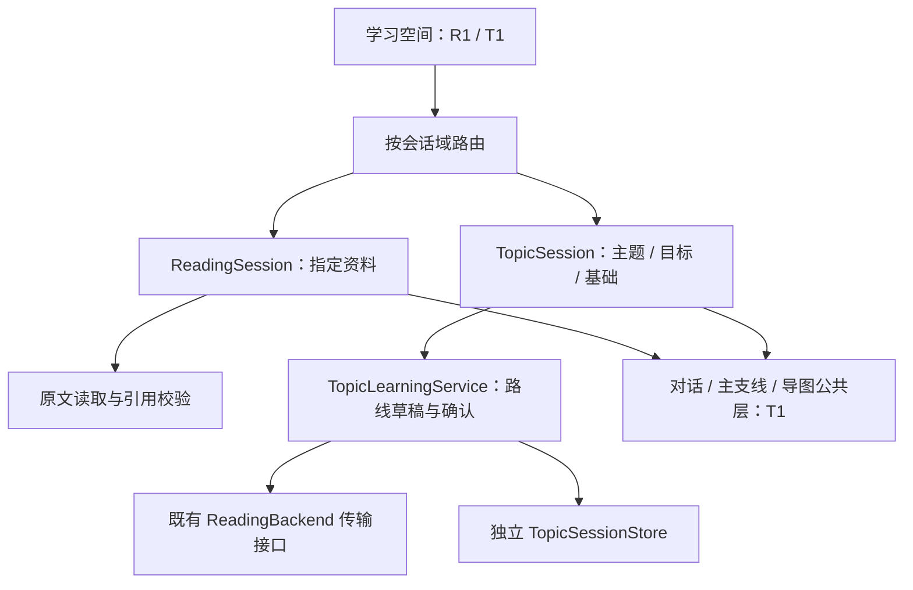

# 主题学习：架构、开发流程与 T0 交付

更新日期：2026-09-11。用户希望用对话与思维导图学习自行提出的主题，允许一般知识讲解不依赖库内材料。本文件将该需求落实为[开发路线](development-roadmap.md)的 T0–T2；它不改变资料阅读的证据校验，也不替代 R0 尚未完成的独立科学审阅。

本文保留 **T0 底层服务**的架构与历史验证，当时插件版本为 `0.52.2`。后续 `0.53.0` 交付 R1 首批导航，`0.54.0` 已交付 [T1.1 主题创建、历史与路线编辑器](topic-planning-t11.md)。现在可从“主题路线（预览）”保存目标和安排路线；下一步接 T1.2，讲解、对话与导图尚未开放。

## 1. 用户流程与首版边界

1. 在学习空间选择“从资料开始”或“从主题开始”。前者保留既有文献和代码入口，后者填写主题、希望达到的目标及已有基础。
2. 主题目标可以先保存，无需资料或模型。用户明确生成路线时才调用所选模型；也可手动填写路线。
3. 路线先展示为草稿，列出每个单元的中心问题、学习目标与先修关系。用户调整并确认后开始讲解。确认的是学习安排，不是事实核验或掌握程度。
4. 每次推进一个主线单元。疑问可从某个节点分出支线，返回时保留主线位置。主线不会把未解决的支线问题自动视为已掌握。
5. 对话与导图展示同一份节点关系。用户标记已理解、待回看或仍有疑问；模型生成完毕只影响讲解进度。
6. 重启后可继续同一会话。选择保存时导出为主题学习记录；添加资料属于独立动作，具体表述取得证据后再按原有规则整理。

T0 覆盖第 2–3 步的服务接口与持久记录。入口、路线编辑器、正文讲解、主支线和导图、理解标记、导出属于 T1。资料选择和显式联网属于 T2。首版不增加练习执行、考试评分、自动搜集教材或后台生成全部课程。

## 2. 与当前架构的关系



图中的学习空间路由已由 R1 和 T1.1 接入，公共对话与导图层尚待 T1.2。下表为 T0 契约、规划和存储文件，原生界面与编辑控制器见 [T1.1 交付记录](topic-planning-t11.md)。

| 文件 | 当前职责 |
|---|---|
| [`types.ts`](../src/topic-learning/types.ts) | 无文件来源的 `TopicSession`、学习意图、路线单元和路线来源 |
| [`contracts.ts`](../src/topic-learning/contracts.ts) | 独立 `t-…` 身份、严格字段校验、先修关系及确认凭据 |
| [`planning.ts`](../src/topic-learning/planning.ts) | 主题专用提示与 JSON 格式；复用现有后端请求接口，一次显式调用 |
| [`store.ts`](../src/topic-learning/store.ts) | 独立主题修订、提交标记、只读恢复和并发检测 |
| [`service.ts`](../src/topic-learning/service.ts) | 创建目标、修改意图／路线、生成、确认、取消 |

`ReadingSession` 的强制来源、候选证据、页码／结构块和代码引用规则均未修改。主题不是新增的 PDF 类型，没有 `source.path`、来源指纹、`paperId` 或 `x-ray` 深度。路线摘要只校验用户确认的目标与路线是否变化，不能作为科学证据。

后续只在确有两种调用者时提取公共接口：导图依赖节点关系和折叠状态，对话依赖消息、主支线和视图状态。资料选择、证据核验、课程规划分别保留在各自服务中。不能给旧类型塞入虚构来源以便强行复用整个阅读引擎。

## 3. 知识来源规则

| 内容 | 来源要求 | 进入正式知识的条件 |
|---|---|---|
| 稳定的一般概念和背景 | 允许模型一般知识，明确未据此读取库内资料 | 保留一般背景标记，不成为论文支持的结论 |
| 用户表达和个人理解 | 保留用户来源 | 用户选择保存；个人判断与作者结论分开 |
| 示例、类比和假设 | 明示用途、假设及失效条件 | 不能伪装成实验观察或真实数据 |
| 某篇论文或代码的具体结论 | 必须实际读取指定材料并绑定位置／版本 | 继续通过既有证据和整理校验 |
| 最新进展或外部资料 | T2 显式查询后保留真实来源，未查证时说明缺口 | 外部内容不冒充库内证据 |

T0 只生成学习安排，不生成教学正文。模型路线记录 `model-knowledge` 和实际传入的供应商／模型名称；手动路线记录 `user`。提示约束与格式检查不能证明事实正确，真实教学质量仍待 T1 样本审阅。

主题历史不出现在文献库中，不注册为论文、不自动导出 Wiki、不建立向量索引。后续学习记录检索须显式纳入主题域；仅基于库内证据的回答继续排除一般知识讲解。T2 关联资料也不能自动提升整段历史的证据等级。

## 4. T0 状态与保存契约

状态由字段推导，不用“学习完成”描述路线生成：

```text
仅有目标 → 生成或填写路线 → 待确认路线 → 用户确认
  ↑             ↑                 |
  └─ 修改目标 ──┘      修改路线后重新确认
```

- 必须填写主题和目标；基础允许留空，但不能推断用户已经掌握先修知识。
- 路线限定 2–12 个单元，含唯一标识、标题、中心问题、学习目标及先修标识。先修只能指向此前单元，拒绝重复、缺失、自引用或循环。
- 模型输出不能包含证据 ID、掌握标记或自动确认字段；这些字段不属于主题路线格式。
- 修改目标后当前路线和确认失效；修改路线后确认失效。旧修订仍保留。相同内容的重复保存与重复确认不新增修订。
- 生成过程不写持久的“正在运行”状态；重启只恢复已经提交的目标和路线，不自动续发模型请求。
- 所有编辑携带上次读取的修订摘要。模型返回时目标已修改，或者其他写入者已提交时，旧请求不能覆盖新内容。
- 同一服务内同一会话的生成不能重复启动；一次操作只发一次请求，失败需显式重试。支持取消与 3 分钟超时，后端迟到的结果不会提交。
- 提交 `.ready` 标记开始前接受取消；发布已经开始后不以删除记录实现回滚。界面接入时须区分生成取消与已提交结果。

`TopicSessionStore` 接受现有 `SourceStorage` 的受限文件操作接口。T1 接入时使用插件目录作为根，写入 `topic-learning-sessions/<t-id>/`；T0 测试只使用内存和新建临时文件夹，未在用户插件目录创建此根。

每次保存新建一个修订 JSON，完成同步后创建同名 `.ready` 摘要标记。读操作不创建目录、不修复、不改写文件；无标记的中断尝试可见但不作为当前状态。正文损坏、摘要冲突或多头并发历史阻止新写入，同时返回已保留的历史和诊断，不按时间自动选胜者。

当前上限为每主题 128 次路线修订、每修订 128 KiB；这是目标与路线阶段的容量约束，不能直接用于持续对话。T1.1 已允许查看多头历史并从指定版本创建独立副本，不覆盖原冲突；正文增长后的节点存储留待 T1.2。新旧记录迁移仍归 R4，不迁移或双写已有阅读数据。

## 5. 后续开发顺序与发布门槛

| 步骤 | 实施内容 | 验收门槛 |
|---|---|---|
| T0（本次） | 无资料目标、路线生成／编辑／确认、独立持久存储 | 无模型可保存；旧阅读规则不放宽；取消、恢复、保存失败、迟到结果和并发可检测 |
| R1 首批（已交付） | 只读文献列表、详情、继续阅读；学习入口与会话域路由准备 | [0.53.0 交付记录](library-navigation-r1.md)说明原生与工程验证范围；页面零模型调用，不展示主题空按钮 |
| T1.1（已交付） | 主题创建、历史与路线编辑器；模型选择、本次用量和错误展示 | [0.54.0 交付记录](topic-planning-t11.md)列出原生与工程验证；使用独立存储和模拟模型，不计为真实教学验收 |
| T1.2 | 提取并复用主支线、对话和导图接口；主题专用教学引擎 | 节点 ID 稳定；主线推进、支线记忆和返回位置正确；确认后路线变更不重解释旧节点 |
| T1.3 | 理解标记、学习记录导出、原生测试与真实教学审阅 | 生成不等于掌握；导出明确来源；重启与窄窗口可用；通过冻结样本后开放完整主题学习流程；T1.1 仅开放路线预览 |
| T2 | 指定资料与显式外部补充，按表述核对证据 | 未读取来源不能引用；资料绑定失效提示复查；一般知识不污染论文检索和正式证据 |

T1 的目标是完成一条可用的学习流程。它依赖 R1 的首批入口基础，不等待 R2–R6 全部结束；也不把主题学习插入尚未通过科学审阅的旧论文规则中。

新增或变更教学规则时，先冻结用户目标、背景、期望检查点和失败反例，再保留模型实际请求与首次响应。开发者检查与独立教学／事实审阅分开，保留失败回答，不通过重写参考要点来消除错误。

T1 的起始样本（尚未执行真实教学）：

| 场景 | 应检查的行为 |
|---|---|
| 零基础理解机器学习 | 目标先收敛；区分数据、目标、训练与评估，解释必要术语 |
| 会 Python，希望理解神经网络 | 先修关系合理；拆开损失、梯度与参数更新，不假定懂微积分 |
| “训练误差低就一定泛化好吗”支线 | 纠正误解并限定条件；返回主线位置不变，不自动标记已掌握 |
| 要求引用空库中的论文 | 明确没有可核验的库内来源，一般解释不能附虚假本地引用 |
| 要求最新模型排名 | 未查证时明确缺口，不把旧模型知识写成已核验的最新事实 |

## 6. T0 历史验证与限制

- `pnpm test:topic-learning`：内存测试覆盖新旧领域隔离、无模型保存、路线校验、显式生成与确认、只读恢复、迟到结果、取消、保存失败、损坏和并发冲突；真实文件测试覆盖独占创建、原始字节保留、中断尝试保留及独立进程重启恢复。
- 旧资料回归使用 `pnpm test:r0`，并定向运行原阅读路线、会话和领域测试；执行前检查删除行为。代码完成类型检查、生产构建和发布结构检查。
- 只使用模拟模型响应，没有调用真实供应商，不能据此报告教学准确率或学习效果。T1 UI、用量接入、正文与支线存储、主题导图、导出和真实教学样本仍未完成。
- 本次不修改正式 Vault、知识索引、论文笔记或日志；不升级／部署插件，也不读取论文形成新科学结论。测试创建的临时文件保留，不批量清理。
